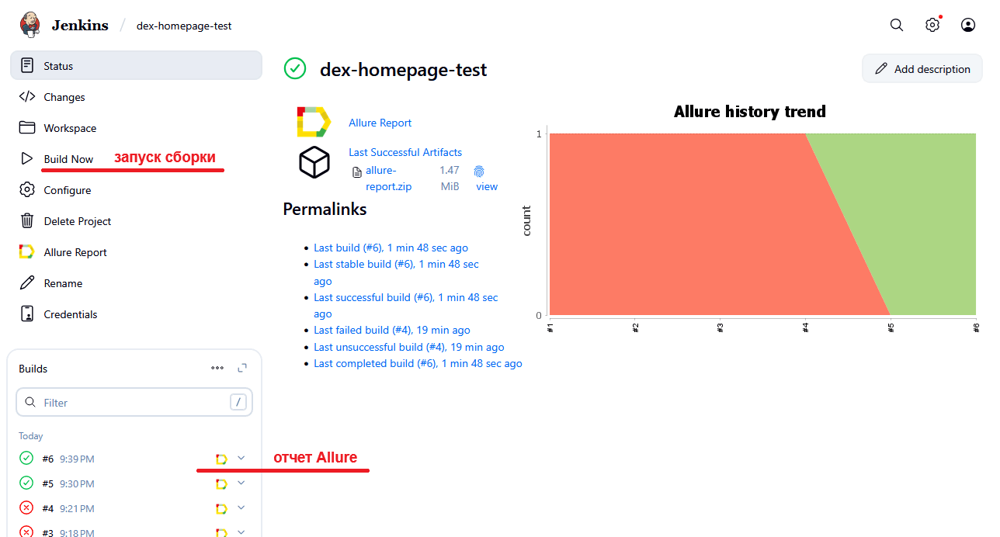
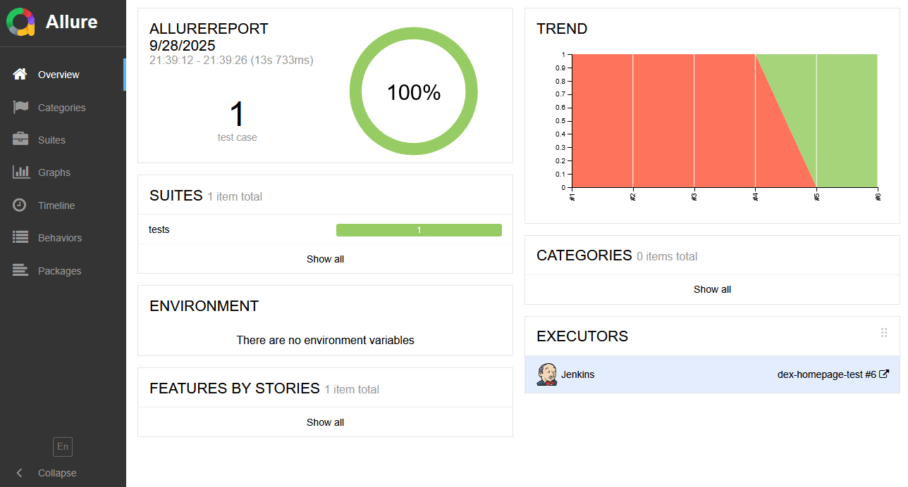
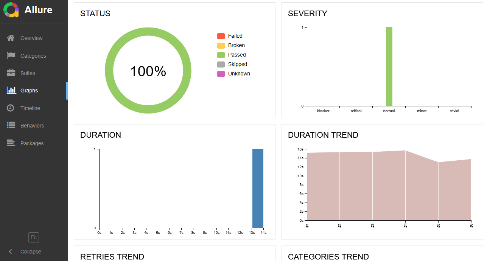
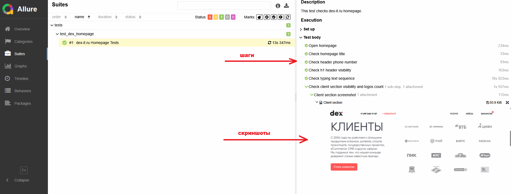
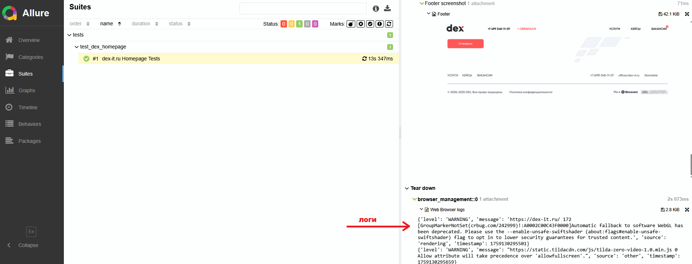
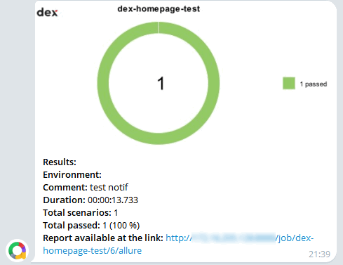

##  Проект UI автотестов домашней страницы https://dex-it.ru/

<!-- Технологии -->

### Используемые технологии/инструменты:
* Pytest
* Selene
* Allure
* Jenkins

<!-- Краткое описание -->

### Краткое описание:
Набор UI автотестов проверяет различные элементы домашней страницы компании DEX - открытие страницы, meta/SEO информацию, наличие h1 заголовка, номера телефона в хэдере, блока Клиенты, а также корректность ссылок в футере. Тесты написаны по Page Object шаблону, результаты собираются через Allure.

<!-- Тест кейсы -->

### Что проверяем:
* Открытие домашней страницы https://dex-it.ru/
* Проверка meta/SEO: title и непустой h1
* Проверка номера телефона компании в хэдере
* Хэдер страницы: проверка смены слов в анимации ("АНАЛИТИКА -> ДИЗАЙН -> РАЗРАБОТКА -> ПОДДЕРЖКА -> РАЗВИТИЕ"), которые циклично "печатаются" в этом блоке:


* Блок c логотипами клиентов: видимость логотипов, их количество
* Футер: проверка текста и ссылок в блоке "УСЛУГИ / КЕЙСЫ / ВАКАНСИИ"

<!-- Jenkins -->

###  Запуск проекта в Jenkins

##### При нажатии на "Build Now" начнется сборка тестов и их прохождение:


<!-- Allure report -->

###  Allure report

##### После прохождения тестов, результаты можно посмотреть в Allure отчете:


##### Во вкладке Graphs можно посмотреть графики о прохождении тестов по их серьезности, времени прохождения, статусу и др.:


##### Во вкладке Suites находятся тест кейсы с описанными шагами, логами браузера и скриншотами:



<!-- Telegram -->

###  Интеграция с Telegram
##### После прохождения тестов, в Telegram bot приходит сообщение с графиком и небольшой информацией о тестах:


### Как запустить локально:
```bash
# создать виртуальное окружение
python -m venv venv
# активировать (Linux/macOS)
source venv/bin/activate
# (Windows)
# venv\Scripts\activate

# установить зависимости
pip install -r requirements.txt

# запустить тесты
pytest tests

# сформировать html–отчет, который откроется в браузере по умолчанию автоматически
allure serve tests/allure-results